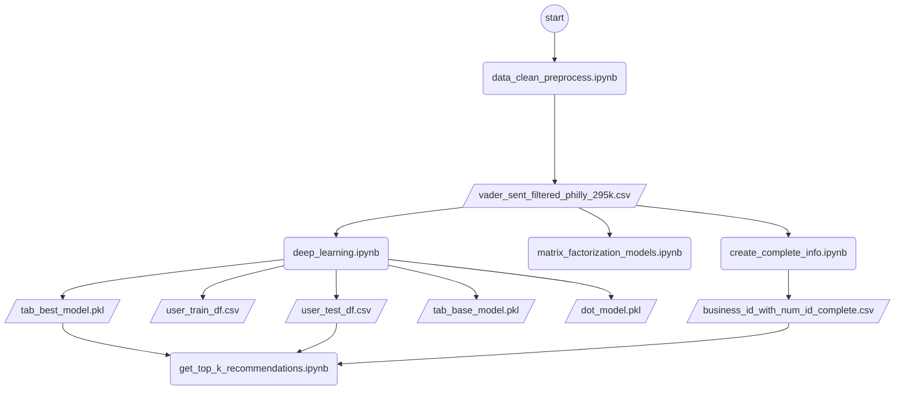

## Restaurant Recommendation System Implementation using Matrix Factorization-based and Deep Learning-based Model
Final Project SDSC3002 Data Mining - Grade: 95/100
- Lecturer: Dr. YANG Yu
- City University of Hong Kong

### Authors
This project was created by:
 - ABDINEGARA, Beatrice
 - GUSTAF, Benedict Ronaldo
 - HA, Quang Minh
 - YENNOTO, Keane Dylan
> Detailed report about this project can be seen at  'Report_SDSC3002 Data Mining.pdf'

### Requirements
These packages can be installed using pip by running the following command:

```
pip install -r requirements.txt
```

### Notebooks

The notebooks should be run in the following order:

1. `data_clean_preprocess.ipynb`: Preprocesses the raw data and saves the preprocessed data to a CSV file.
2. `matrix_factorization_models.ipynb`: Implements and evaluates three matrix factorization models: SVD, SVD++, and NMF.
3. `deep_learning.ipynb`: Implements and evaluates a deep learning-based model using FastAI.
4. `get_top_k_recommendations.ipynb`: Generates top-k recommendations for a given user based on the best-performing model.

### Flowchart

The following flowchart illustrates the data processing pipeline and the relationships between the notebooks:


