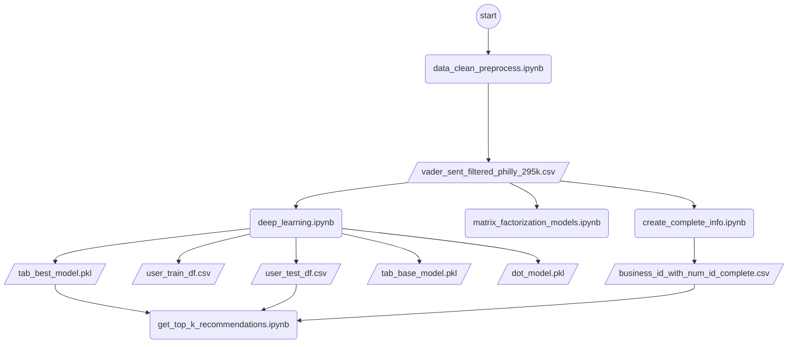

# How to run the code:

Please open this README file in [StackEdit](https://stackedit.io/app#) 

 1. Within StackEdit click the StackEdit logo on the top right coner, a side bar should pop-up
 2. Scroll down to Import/Export
 3. Click Import Markdown and choose this current file
 4. View the file from StackEdit
	
This code is written in Python language, through Jupyter Notebook. 

The submitted code is already been in clean state, running from top to bottom works as intended.

so in general, the output of the code will be automatically shown in the
Jupyter Notebook. 

However, if you would like to run the code again 
from the beginning, the way to do it is:

1. Open the OneDrive link: 
https://portland-my.sharepoint.com/:f:/g/personal/dkyennoto2-c_my_cityu_edu_hk/EsoI4CVaCy9Hsn-60brXEiMBZiYlns7LJnYrkAVuqEg7JQ?e=T76VAc

2. Download all the files within the OneDrive link
3. No need for changes in the path of the files. All the files need to be in one folder  

4. Type pip install -r requirements.txt on the terminal
5. You now can start running the notebooks (refer to the flowchart below of the execution order)
6. Quick start guide on running JupyterNotebooks
	a. To run each cell one by one, you can click "Run" button on the top menu under "Cell" menu
	
	b. Or to run all and generate output of all cells, simply click "Kernel" on the top menu, then click "Restart & 	  Run All"
	
	c. Wait for each cell to be executed

###  Flowchart

